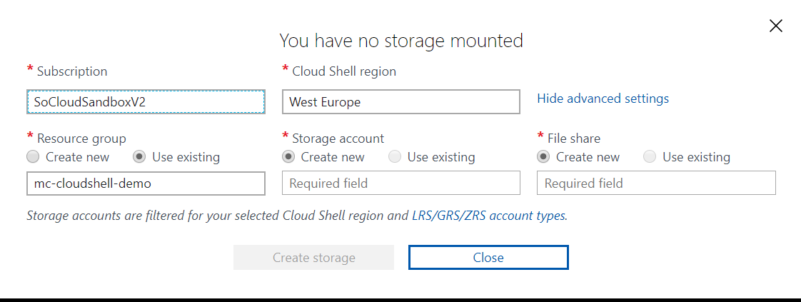

# Azure Cloud Shell

Simple et complet, il est fait pour vous ! 

## Création

Se rendre sur l'url [https://shell.azure.com](https://shell.azure.com)

Si vous n'avez pas encore créé d'instance d'Azure Cloud Shell, une modale apparaitra afin de configurer votre instance.

Choissisez les paramètres avancés afin d'obtenir l'interface suivante :

Afin de gagner du temps, il faut bien remplir les champs suivants :

- Cloud Shell region : une région en adéquation avec votre localisation
- Resource Group : choissisez un existant pour ce lab, votre cloud shell sera détruit à la fin
- Storage Account : saisissez un compte existant ou un nom random
- File share: saisissez un compte existant ou un nom random

## Utilisation

Il est possible d'utiliser Cloud Shell depuis l'url [https://shell.azure.com](https://shell.azure.com) ou depuis le portail Azure, en fonction de votre écran ou de votre usage la page dédiée est bien pratique

Pour savoir quels sont les outils disponible dans Cloud Shell, le mieux est d'aller voir la doc : [Documation Cloud Shell Tools](https://docs.microsoft.com/en-us/azure/cloud-shell/features#tools)
