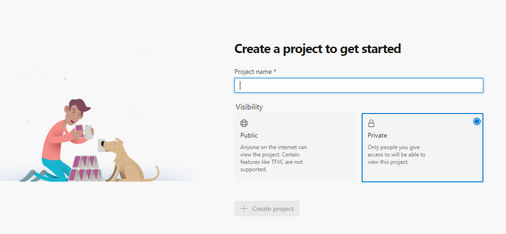
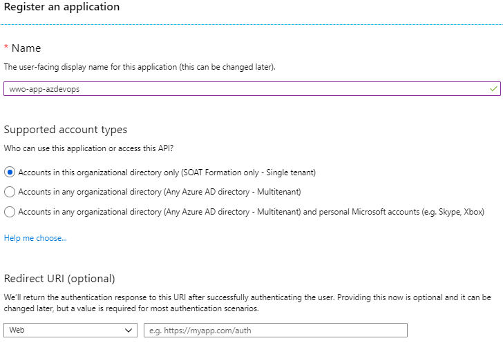
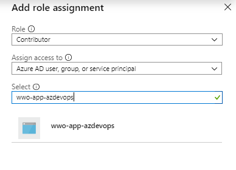
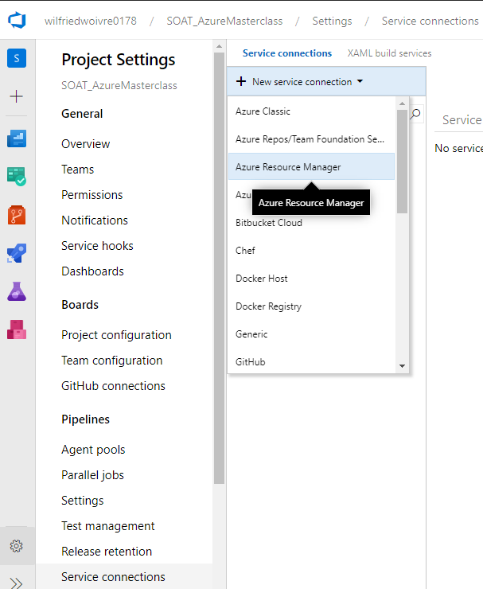
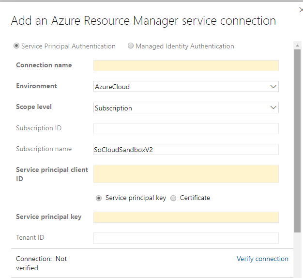
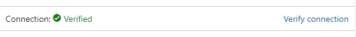

# Azure DevOps

## Création du compte Azure Devops

Se rendre sur l'url : [https://dev.azure.com](https://azure.microsoft.com/en-us/services/devops/?nav=min)

Créer un compte ou en utiliser un existant. **Pour le reste du lab, il vous faudra des droits avancés, donc je vous conseille d'en créer un nouveau pour l'occasion**

## Création d'un projet

Par défaut Azure Devops vous dirige vers la création d'un nouveau projet, ce que l'on va faire.

Ce projet doit être **privé**, je vais pour ma part l'appeler *SOAT_AzureMasterclass*

## Connexion à Azure

### Création d'une application

Sur le portail [Azure](https://portal.azure.com) et se rendre sur le service **Azure Active Directory** > **App Registrations**

Créer une nouvelle application comme suit :

Ce qu'il faut récupérer après la création de votre application, ce sont les champs suivants :

- Directory (tenant) ID
- Application (client) ID

Ensuite il vous faut une clé de sécurité où un certificat pour vous authentifier à Azure grâce à cette application.
Ici on va créer un **secret** avec une durée de vie de 1 an.

Ne pas oublier de copier la valeur de ce secret : 

Vous avez donc maintenant dans votre presse papier

- Directory ID
- Application Id
- Secret

### Ajout de droits

Sur votre groupe de ressource dans la blade **Access Control (IAM)**, ajouter votre application en tant que Contributor, comme suit :

Récupérer les éléments **SubscriptionId** et **SubscriptionName**

### Configuration Azure DevOps

Dans l'onglet **Project Settings**, ajouter un **Service Connection** de type **Azure Resource Manager**

Il faut ensuite utiliser la modale en mode **Full Dialog**

Il faut maintenant remplir les champs suivants :

- Connection name : Azure Sandbox
- Environment : AzureCloud
- Scope level : Subscription
- Subscription ID : **Votre id de souscription**
- Subscription Name : **Votre nom de souscription**
- Service principal client ID : **ApplicationID**
- Service principal key : **Client Secret**

Ne pas oublier de vérifier votre connexion avant de quitter la fenêtre de dialogue.

