# Déployer votre infrastructure depuis Azure DevOps

## Cloner votre repo Azure DevOps

Depuis Azure Cloud Shell, il faut générer une clé SSH via la commande suivante : 

```bash
 ssh-keygen -C "myaccount@mydomain.com"
```

Par défaut votre clé SSH va se retrouver dans le dossier suivant


```bash
ls /home/<usr>/.ssh/
-rw------- 1 <usr> <usr> 1766 Oct 22 13:11 id_rsa
-rw-r--r-- 1 <usr> <usr>  427 Oct 22 13:11 id_rsa.pub
```

Récupérer le contenu de votre fichier ***id_rsa.pub*** et copier le. 

Dans Azure DevOps, dans les paramètres de sécurité

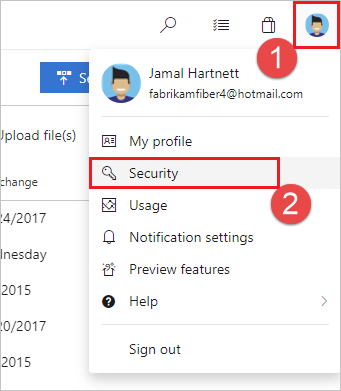

Ajouter une nouvelle clé SSH


Ajouter le contenu de votre fichier id_rsa.pub comme suit :

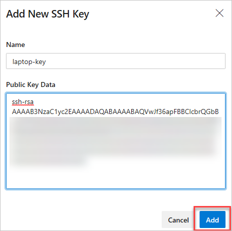

Vous pouvez maintenant retourner dans Cloud Shell et cloner votre repo

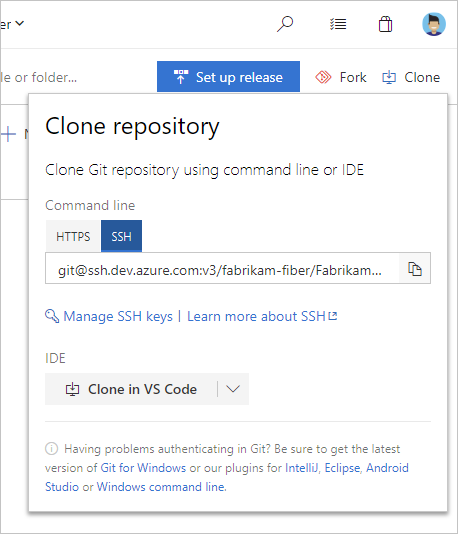

Ajouter votre fichier **azuredeploy.json** que vous avez créer durant ce lab à votre repo git (il est possible de glisser le fichier directement dans Cloud Shell). 

Une fois qu'il est disponible sur Azure DevOps vous devriez le voir sur le site dans la partie **Repos**

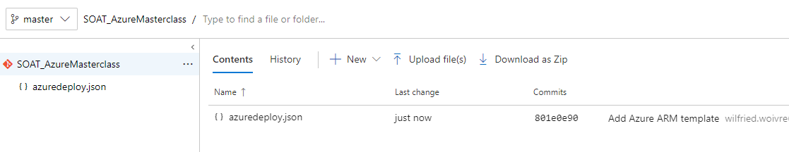

## Créer son pipeline de release

Maintenant que notre template est disponible dans notre repository, il faut créer notre premier pipeline de release :

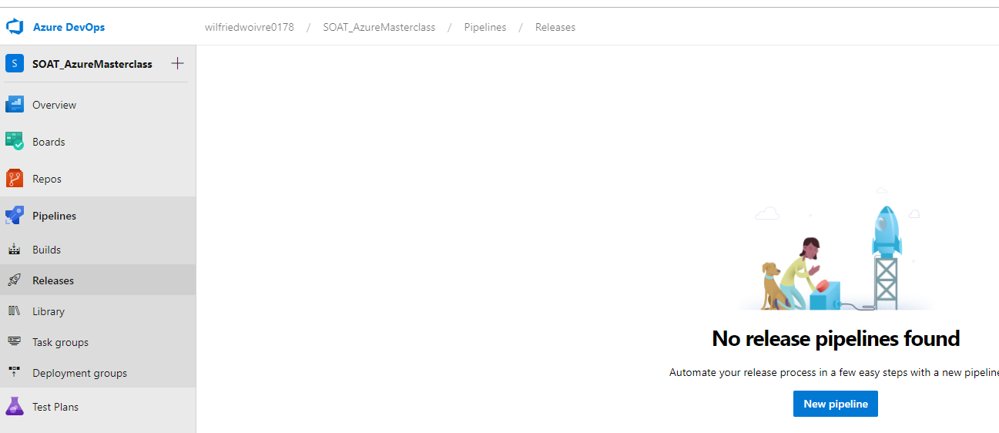

Partons d'une feuille vierge et sélectionnons un job vide que l'on completera par la suite : 

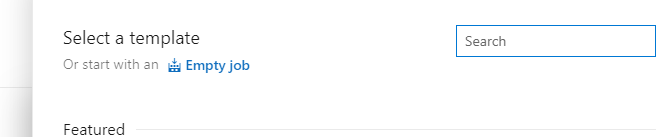

Dans les artifacts, nous allons ajouter le code de notre repos Azure DevOps

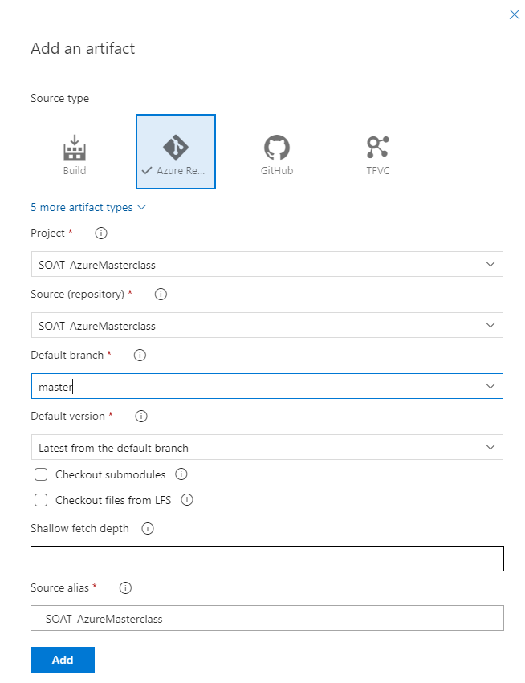

On va maintenant ajouter une tâche à notre Job qui consistera à déployer un template ARM :

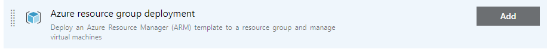

Ici nous retrouvons le choix de notre souscription Azure que vous avez créé lorsque vous avez configuré votre Azure DevOps

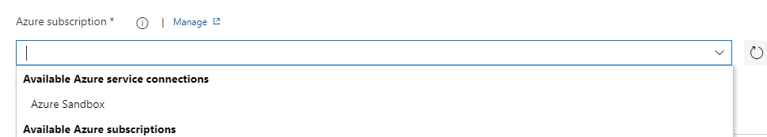

Le reste de la configuration consiste à sélectionner notre groupe de ressource, notre fichier ARM depuis notre artifact, puis d'y injecter des paramètres afin que la webapp, le keyvault et le compte de stockage aient des noms différents sur Azure

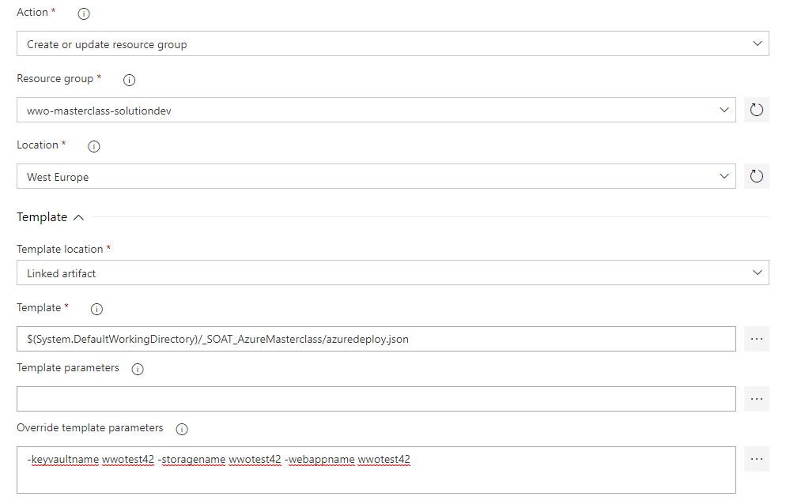

Maintenant que la configuration est terminée, il faut sauvegarder votre pipeline et créer une release, si vous avez tout fait correctement, vous aurez un statut réussi du premier coup.

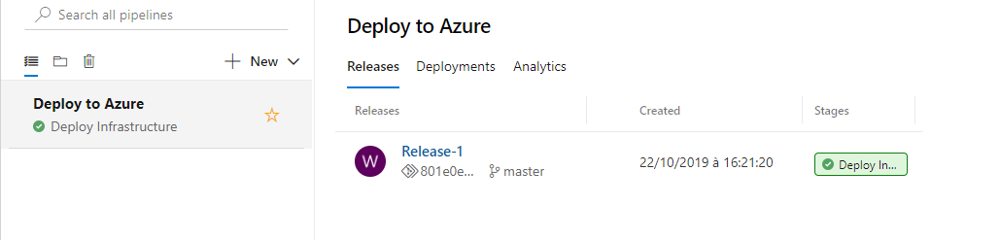
