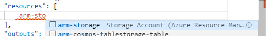
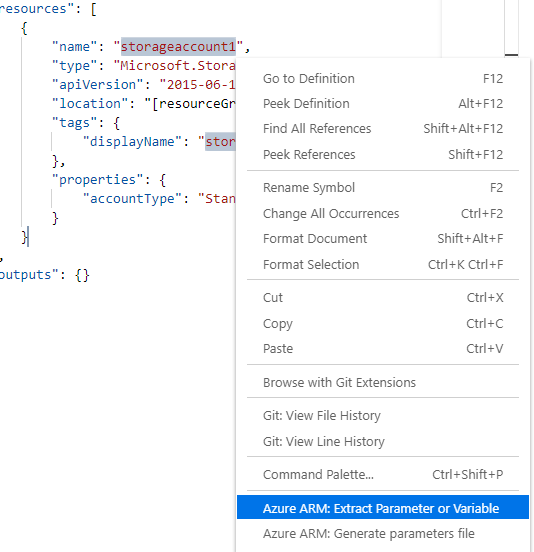
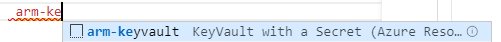
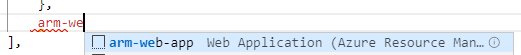
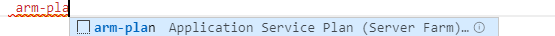
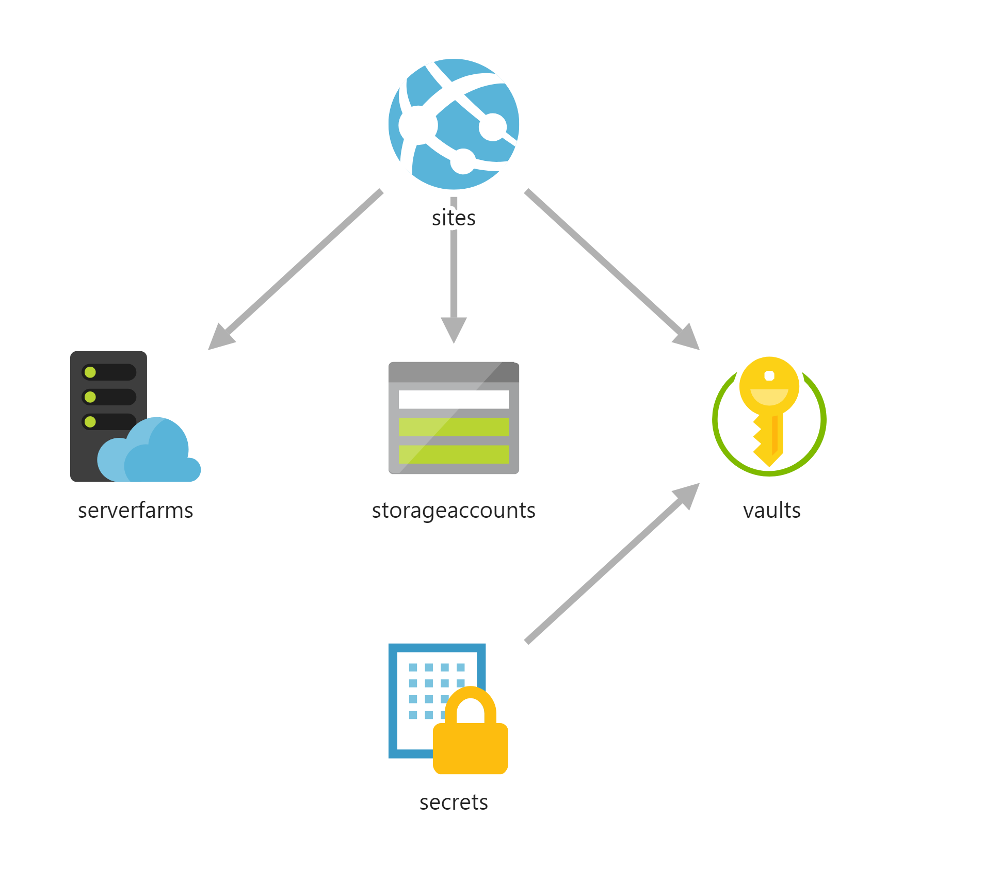

# Démarrer avec Azure ARM

[!INCLUDE https://github.com/MicrosoftDocs/azure-docs/blob/master/includes/cloud-shell-try-it.md]

Le but de ce lab est de déployer une infrastructure sur Azure contenant une Web App, un KeyVault et un compte de stockage

## Installer les bons outils

- Visual Studio Code : [https://code.visualstudio.com/Download](https://code.visualstudio.com/Download)
- Extensions Visual Studio Code :
  - [Microsoft ARM Tools](https://marketplace.visualstudio.com/items?itemName=msazurermtools.azurerm-vscode-tools) par Microsoft
  - [Azure ARM template](https://marketplace.visualstudio.com/items?itemName=samcogan.arm-snippets) par [Sam Cogan](https://samcogan.com/) - MVP Microsoft Azure
  - [Azure ARM Params Generator](https://marketplace.visualstudio.com/items?itemName=wilfriedwoivre.arm-params-generator) par [Wilfried Woivré](https://blog.woivre.fr) - MVP Microsoft Azure
  - [ARM Template Viewer](https://marketplace.visualstudio.com/items?itemName=bencoleman.armview) par [Ben Coleman](https://benco.io/) - Microsoftee

## Créer son premier template ARM

Créer un fichier **azuredeploy.json** et l'ouvrir depuis VSCode.

Ajout la structure du template via le snippet **arm!** comme suit:


Si votre environnement est bien configuré, votre fichier sera maintenant du type **Azure Resource Manager Template**


### Le compte de stockage

Pour créer un compte de stockage en ARM, il faut se référer à la dernière version de Storage Accounts : 
[Azure Storage ARM Reference](https://docs.microsoft.com/en-us/azure/templates/microsoft.storage/allversions)

***Attention tous les champs ne sont pas obligatoires***

N'oubliez pas de mettre le nom de votre compte de stockage en paramètre afin d'avoir un nom unique sur Azure.

<details>
  <summary>Spoiler Alert !</summary>
  
  Vous pouvez utiliser les snippets Azure pour créer votre déclaration pour votre storage

  

  Pour le nom de votre compte de stockage, utilisez la commande **Azure ARM: Extract parameters or variables** et créer un nouveau paramètre.
  
  
</details>

### Le KeyVault

Pour créer un keyvault en ARM, il faut se référer à la dernière version de KeyVault :
[Azure Keyvault ARM Reference](https://docs.microsoft.com/en-us/azure/templates/microsoft.Keyvault/allversions)

***Attention tous les champs ne sont pas obligatoires***

N'oubliez pas de mettre le nom de votre keyvault en paramètre afin d'avoir un nom unique sur Azure.

Faites bien attention aux propriétés ***tenantId*** et ***Access Policies***

Si vous souhaitez ajouter votre compte dans les Access Policies, il est possible de récupérer votre ***ObjectId*** via la commande az cli suivante :

```bash
echo "Enter your email address that is used to sign in to Azure:" &&
read upn &&
az ad user show --id $upn --query "objectId" &&
echo "Press [ENTER] to continue ..."
```

<details>
  <summary>Spoiler Alert !</summary>

  Vous pouvez utiliser les snippets Azure pour créer votre déclaratio pour votre KeyVault

  

  Le tenant Id peut être défini par la fonction suivante en ARM : ***[subscription().tenantId]***
</details>

### Le service plan

Pour créer un service plan en ARM, il faut se référer à la dernière version de ServerFarms :
[ServerFarms ARM Reference](https://docs.microsoft.com/en-us/azure/templates/microsoft.Web/allversions)

***Attention tous les champs ne sont pas obligatoires***

### Web App

Pour créer une WebApp en ARM, il faut se référer à la dernière version de sites :
[Sites ARM Reference](https://docs.microsoft.com/en-us/azure/templates/microsoft.Web/allversions)

***Attention tous les champs ne sont pas obligatoires***

N'oubliez pas de mettre le nom de votre App en paramètre afin d'avoir un nom unique sur Azure.

Prenez bien soin de mettre en place des dépendances entre vos services afin que votre Web App se déploie après votre Storage et votre KeyVault.

<details>
  <summary>Spoiler Alert !</summary>

  Vous pouvez utiliser les snippets Azure pour créer votre déclaration pour votre WebApp + Service Plan

  
  
</details>

Si votre template ARM est parfait vous devriez avoir un visuel comme celui-ci dans **ARM Viewer**


