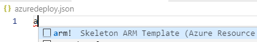
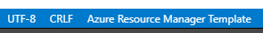

# Démarrer avec Azure ARM

Le but de ce lab est de déployer une infrastructure sur Azure contenant une Web App, un KeyVault et un compte de stockage

## Installer les bons outils

- Visual Studio Code : [https://code.visualstudio.com/Download](https://code.visualstudio.com/Download)
- Extensions Visual Studio Code :
  - [Microsoft ARM Tools](https://marketplace.visualstudio.com/items?itemName=msazurermtools.azurerm-vscode-tools) par Microsoft
  - [Azure ARM template](https://marketplace.visualstudio.com/items?itemName=samcogan.arm-snippets) par [Sam Cogan](https://samcogan.com/) - MVP Microsoft Azure
  - [Azure ARM Params Generator](https://marketplace.visualstudio.com/items?itemName=wilfriedwoivre.arm-params-generator) par [Wilfried Woivré](https://blog.woivre.fr) - MVP Microsoft Azure
  - [ARM Template Viewer](https://marketplace.visualstudio.com/items?itemName=bencoleman.armview) par [Ben Coleman](https://benco.io/) - Microsoftee

## Créer son premier template ARM

Créer un fichier **azuredeploy.json** et l'ouvrir depuis VSCode.

Ajout la structure du template via le snippet **arm!** comme suit:

Si votre environnement est bien configuré, votre fichier sera maintenant du type **Azure Resource Manager Template**

### Le compte de stockage

Test spoiler

>! dfkj

