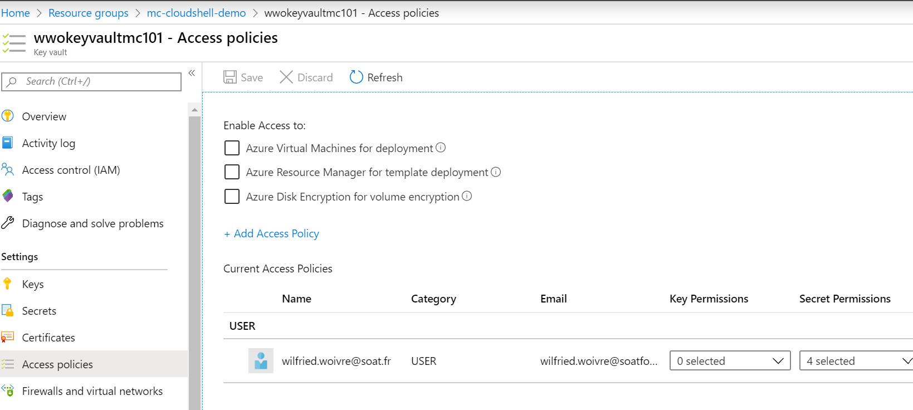

# Mise en place d'un Azure Key Vault

## Création d'un Azure Key Vault

Il est possible de créer un compte Azure Key Vault de bien des manières, tel que

- Le portail Azure
- Azure CLI
- Azure Powershell
- Terraform
- Azure ARM Template

A vous de choisir la meilleure option pour votre use case, ici nous allons choisir de la faire via la cli depuis Cloud Shell avec la commande suivante :

```bash
az keyvault create -n mykeyvaultname -g myrgname -l westeurope --no-self-perms
```

*Note* : La dernière option fait en sorte que lors de la création, aucun droit par défaut ne soit positionné sur votre Key Vault.

## Gestion des permissions

Sur Azure Key Vault, il y a une différence entre les permissions de manipuler l'objet Key Vault, et ces données.
Le premier droit est issu des permissions lié au RBAC, le second est lié aux Access Policies de chaque Key Vault.

Pour notre lab, nous aurons besoin en tant qu'utilisateur des droits suivants :

- Secrets
  - Get
  - List
  - Set
  - Delete

Ici, nous allons ajouter les droits via le portail Azure, afin d'obtenir un résultat tel que celui-ci


