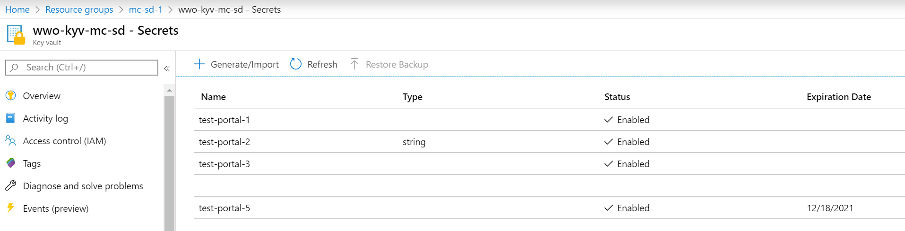

# Manipulation de secret du Key Vault

## Via le portail Azure

Via le portail Azure, ajouter différents secrets afin d'avoir un panel de data disponible pour vos tests. N'hésitez pas à utiliser les différentes options pour vos secrets.

Après l'ajout de quelque secret, votre interface devrait ressembler à celle-ci



## Via az cli

Il est possible de requêter les secrets de son Key Vault via az cli via la commande suivante :

```bash
az keyvault secret list --vault-name keyVaultName --query "[].{Secrets:id,Enabled:attributes.enabled,BeginDate:attributes.created,ExpirationDate:attributes.expires,ContentType:contentType,Tags:to_string(tags)}"-o table
```

Maintenant à vous d'ajouter des secrets dans votre Key Vault à l'aide d'az cli.

## Via une application en node.js

### Récupération de l'exemple 

Via votre Cloud Shell, commencez par clone le repository suivant : [azure-keyvault-nodejs-lab](https://github.com/wilfriedwoivre/azure-keyvault-nodejs-lab)

```bash
git clone https://github.com/wilfriedwoivre/azure-keyvault-nodejs-lab.git

cd azure-keyvault-nodejs-lab
```

Ce repository contient uniquement un template d'application en node.js que l'on va modifier afin d'intégrer Azure Key Vault.

Commençons donc par ajouter les modules manquants

```bash
npm install -y @azure/identity @azure/keyvault-secrets
```

Ces packages nous servent à deux choses :

- **@azure/identity** gère l'authentification à Azure
- **@azure/keyvault-secrets** gère les API d'accès au KeyVault

### Génération d'un Service Principal

Afin de ne pas mettre nos propres credentials dans l'application, nous allons créer un Service Principal sur Azure qui nous permettra de nous authentifier sur notre KeyVault pour récupérer nos secrets.

Sur le portail [Azure](https://portal.azure.com) et se rendre sur le service **Azure Active Directory** > **App Registrations**

Créer une nouvelle application comme suit :


Ce qu'il faut récupérer après la création de votre application, ce sont les champs suivants :

- Directory (tenant) ID
- Application (client) ID

Ensuite il vous faut une clé de sécurité où un certificat pour vous authentifier à Azure grâce à cette application.
Ici on va créer un **secret** avec une durée de vie de 1 an.

Ne pas oublier de copier la valeur de ce secret :

Vous avez donc maintenant dans votre presse papier

- Directory ID
- Application Id
- Secret

*Note* : N'oubliez pas d'ajouter les droits de votre application à votre KeyVault.

### Let's go code

Nous allons maintenant retourner à notre application, et l'ouvrir dans VSCode.

Il est soit possible d'ouvrir code depuis Cloud Shell via un simple **code .** ou d'installer VS Code et les extensions Azure pour ouvrir Cloud Shell depuis son VS Code puis l'application.

On va modifier le fichier **routes/keyvault.js** afin d'ajouter les éléments suivants :

Nos différents import depuis les modules préalablement chargés :

```nodejs
const { ClientSecretCredential } = require('@azure/identity');
const { SecretClient } = require('@azure/keyvault-secrets');
```

Maintenant, nous allons définir nos constantes pour notre application

```nodejs
const tenantId = process.env.TENANT_ID;
const clientId = process.env.CLIENT_ID;
const secret = process.env.CLIENT_SECRET;

const vaultName = process.env.KEYVAULT_NAME;
const vaultUri = `https://${vaultName}.vault.azure.net/`;
```

Et enfin, nous allons mettre à jour notre route de la manière suivante

```nodejs
router.get('/', async function (req, res, next) {
    let credentials = new ClientSecretCredential(tenantId, clientId, secret);

    let client = new SecretClient(vaultUri, credentials);
    let secrets = [];

    for await (const secret of client.listPropertiesOfSecrets()) {
        let secretData = await client.getSecret(secret.name);
        secrets.push({ name: secret.name, value: secretData.value })
    }

    res.render('keyvault', { title: 'List Azure Key Vault Secrets', secrets: secrets });
});
```

## Déployer sur une Web App Azure

### Création de votre Web App
Pour cela, on va créer une Azure Web App sous Linux avec une version de Node.js en LTS.

Vu que vous avez tous suivi la MasterClass Azure Developer, aucun problème pour vous !

<details>
  <summary>Spoiler Alert !</summary>
  
  Vous pouvez utiliser des commandes az cli afin de créer votre application Web

```bash
az appservice plan create -n planName -g rgName -l westeurope --is-linux --sku B1

az webapp create -n myAppName -p planName -g rgName --runtime "node|lts"
```

</details>

### Configuration de votre Web App

Avant de déployer, nous allons ajouter nos différents éléments s'authentifier.

Pour cela il faut ajouter les **ApplicationSettings** suivant :

- **TENANT_ID** : Votre DirectoryId récupéré précédemment
- **CLIENT_ID** : Votre ApplicationId récupérée précédement
- **CLIENT_SECRET** : Le secret de votre application

<details>
<summary>Spoiler Alert !</summary>
```bash
az webapp config appsettings set -g rgName -n myAppName --settings MY_SETTINGS_NAME=value
```
</summary>
</details>

### Déployer votre code via un local git

Durant la masterclass Azure Dev, nous avons fait cette manipulation en utilisant le portail Azure. Cette fois-ci nous allons uniquement utiliser Azure CLI pour cette opération.

Configurons maintenant notre local git sur notre Web App

```bash
az webapp deployment source config-local-git -n myAppName -g rgName
```

Listons les credentials de notre WebApp via la commande

```bash
az webapp deployment list-publishing-credentials -n myAppName -g rgName --query '[publishingUserName,publishingPassword,scmUri]'
```

Il nous reste plus qu'à configurer notre git et push notre code.

```bash
git add .
git commit -m "Update lab"

git remote add azure 'scmUri/myAppName.git'
git push azure master
```


## S'affranchir du Service Principal

Il est possible de s'affranchir du Service Principal en créant une Managed Identity pour notre Web Application.

Pour cela dans la blade `Identity` de notre Web App, nous allons activer notre Managed Identity comme suit :


Nous allons ensuite lui donner les droits sur notre KeyVault.

Nous allons ensuite modifier le code de la manière suivante, pour les requirements, nous allons utiliser ce code à la place:

```nodejs
const { ManagedIdentityCredential } = require('@azure/identity');
```

Et pour notre code d'authentification nous allons utiliser le code suivant :

```nodejs
let credentials = new ManagedIdentityCredential();
```
