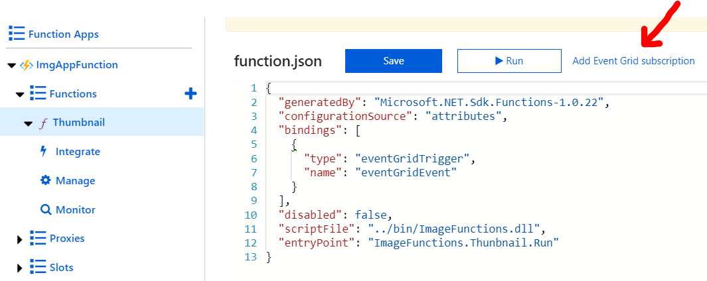
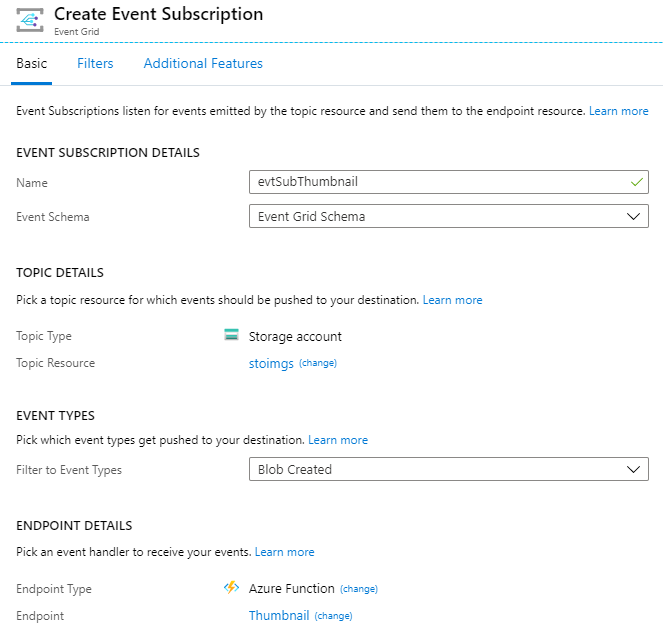
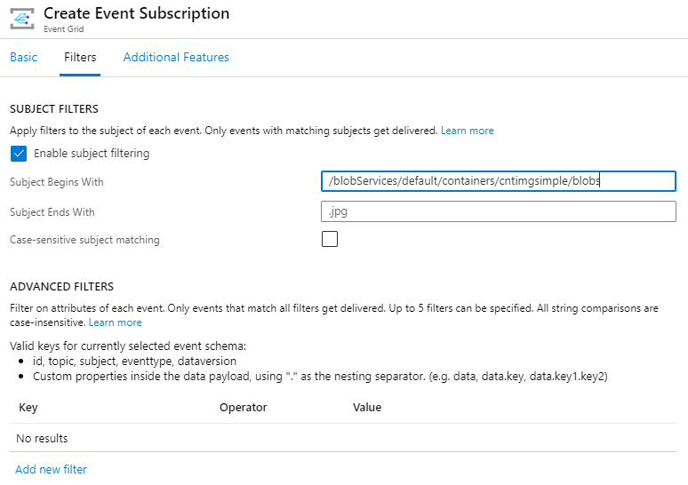

# IMPLEMENTER L'AZURE FUNCTION POUR REDIMENSIONNER LES IMAGES

## Prérequis

Dans un navigateur ouvrez shell.azure.com et vérifier que la ressource Event Grid soit utilisable :

```bash
az provider register --namespace Microsoft.EventGrid
```

Vous pouvez également vous connecter depuis le terminal de Visual Code !

<details>
  <summary>Spoiler Alert !</summary>

```bash
az account clear
az login -u ...@soatformation.onmicrosoft.com -p ...
az account set -s SoCloudSandboxV2
az group list
```

</details>

Il faut récupérer les noms du groupe de ressources et du compte de stockage ainsi que la chaîne de connexion du projet précédent.

<details>
  <summary>Spoiler Alert !</summary>

```bash
rgName=
stoName=
cnSTO=$(az storage account show-connection-string -n $stoName -g $rgName -o tsv)
echo $cnSTO
```

</details>

## Création de la fonction Azure

Il faut un nouveau compte de stockage dédié à la fonction

```bash
stoFunctionName=
az storage account create -n $stoFunctionName -g $rgName -l westeurope --sku Standard_LRS --kind StorageV2
```

Maintenant nous pouvons créer la fonction

```bash
functionAppName=
az functionapp create --name $functionAppName --storage-account $stoFunctionName --resource-group $rgName --consumption-plan-location westeurope
```

## Configuration de la fonction

Maintenant qu'elle est créée, il nous faut un accès au compte de stockage de notre application qui manipule les images. Il faut donc ajouter la chaîne de connexion vers ce compte de stockage.

```bash
az functionapp config appsettings set --name $functionAppName --resource-group $rgName --settings AzureWebJobsStorage=$cnSTO THUMBNAIL_CONTAINER_NAME=thumbnails THUMBNAIL_WIDTH=100 FUNCTIONS_EXTENSION_VERSION=~1
```

## Déployer le code de la fonction depuis un dépôt GitHub

```bash
az functionapp deployment source config --name $functionAppName --resource-group $rgName --branch master --manual-integration --repo-url https://github.com/Azure-Samples/function-image-upload-resize
```

## Configuration de l'Event Grid subscription depuis l'Azure Function

Depuis le portail Azure, sélectionnez la fonction **Thumbnail** et suivez les manipulations suivantes







## Test du redimensionnement automatique d'image

Depuis le portail Azure, ajouter à nouveau (ou les mêmes) images hautes définitions dans le premier conteneur du compte de stockage.

Il ne vous reste plus qu'à mettre à jour votre application pour qu'elle utilise les thumnails à la place des fichiers raw.
